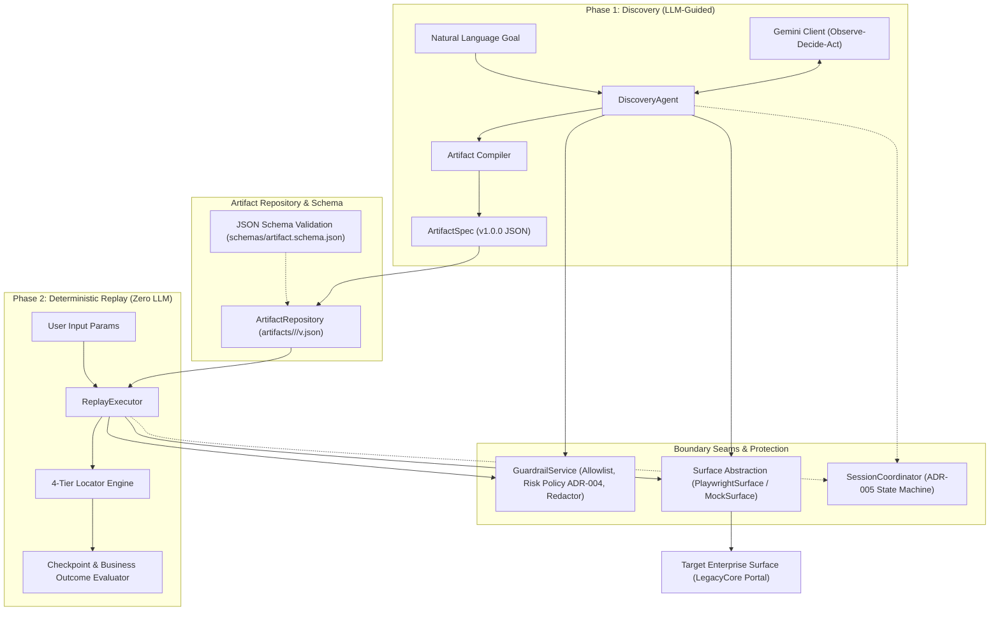
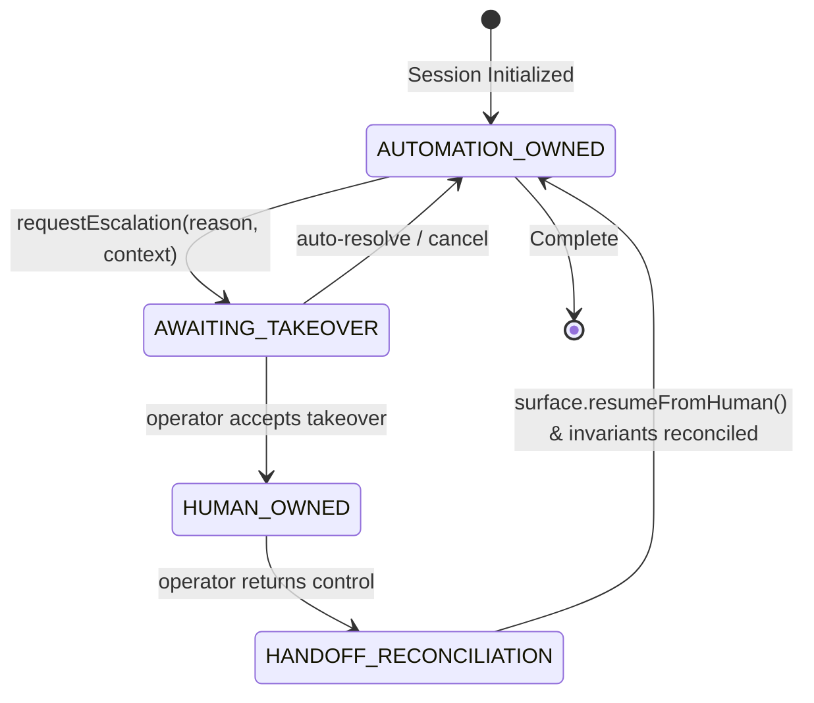

# Engineering Report: Computer-Use Automation System

## 1. Architecture

### 1.1 Two-Phase Decoupled Lifecycle
The system strictly separates exploratory problem solving from production execution by establishing a two-phase lifecycle:
1. **Discovery Phase (LLM-Guided Exploration):** An autonomous `DiscoveryAgent` operates an observe-decide-act loop using a multi-modal planner (Google Gemini 3.6 Flash / Flash-Latest, with automatic model failover and transient 503 exponential backoff). The model perceives DOM and visual screenshots, proposes actions, detects stopping conditions, and compiles the discovered path into a declarative `ArtifactSpec`.
2. **Replay Phase (Zero-LLM Deterministic Execution):** The production execution path (`ReplayExecutor`) takes a compiled capability artifact and user inputs to reproduce the interaction with **zero model inference in the loop**. Replay operates purely through deterministic DOM query algorithms, input parameter interpolation, 4-tier locator fallbacks, and typed checkpoint evaluations.

### 1.2 System Boundary Seams & Architecture Diagram
The codebase is decoupled across four explicit architectural seams defined in [ADR-0002](file:///Users/aryankaradia/projects/interface-ai-oa/docs/adr/0002-architectural-boundaries-and-seams.md):
- **Surface Seam (`Surface` interface):** Abstracts the browser automation driver (`PlaywrightSurface` vs. `MockSurface`). Higher-level agents never invoke Playwright directly.
- **Safety Seam (`GuardrailService`):** Intercepts actions at both discovery and replay phases prior to execution against the browser.
- **Escalation Seam (`SessionCoordinator`):** Manages a 4-state session ownership lifecycle between synthetic automation and human operators.
- **Artifact Seam (`ArtifactRepository` / `compiler`):** Decouples raw LLM conversation history from the typed, reusable capability contract.



---

## 2. Artifact schema

### 2.1 Defense of the Schema Shape ([ADR-002](file:///Users/aryankaradia/projects/interface-ai-oa/docs/adr/ADR-002-artifact-schema-design.md))
The artifact contract is defined in `schemas/artifact.schema.json` and mirrored in TypeScript (`src/artifact/artifact.schema.ts`). Rather than persisting fragile procedural scripts or unstructured LLM transcripts, the schema formalizes an explicit, versioned, declarative data contract:
- **Separation of Concerns:** Transcripts capture *what the LLM thought*; artifacts capture *what actions are required to fulfill the business goal*.
- **Typed Input Schema:** Every parameter defines its JSON type (`string`, `number`, `boolean`), default value, human-readable description, and optional regex validation pattern (`validationRegex`). This prevents malformed data or prompt injections from ever reaching the target DOM.
- **Typed Output Declarations:** Outputs map target DOM element texts, attributes, or regex groups into strongly typed key-value pairs (e.g. `outputs.memberName`, `outputs.balance`).
- **Ordered Deterministic Steps:** Each step specifies a unique identifier (`stepId`), action primitive (`navigate`, `click`, `fill`, `hover`, `press`, `wait`, `extract`), target locator specifications, and self-contained recovery policies (`maxRetries`, `retryDelayMs`, `dismissOverlaysBeforeRetry`).

### 2.2 Targeting Specifications & Robustness Rationale
Each interactive step defines multi-layered targeting parameters rather than a single static selector:
- `semantic`: Role and accessible name (`{ role: "button", name: "Search" }`).
- `anchor`: Visible label text, search direction, and target HTML tag (`{ anchorText: "Member ID:", direction: "right", targetTag: "input" }`).
- `structural`: Normalized CSS or XPath expressions (`{ css: "#ctl00_MainContent_btnSearch_329a" }`).
- `visualFallback`: Normalized bounding coordinates (`{ x: 0.45, y: 0.32, width: 0.08, height: 0.04 }`).

### 2.3 Checkpoint & Business Outcome Separation
A capability must verify completion deterministically. The schema defines a `checkpoint` with:
- `successCondition`: Multi-modal assertions (`element_visible`, `element_has_text`, `url_matches`) that confirm happy-path fulfillment.
- `businessOutcomes`: Explicit declarative branching rules (e.g. detecting the presence of `"No active member records found"` as `MEMBER_NOT_FOUND`, or `"Member account suspended"` as `ACCOUNT_SUSPENDED`) preventing domain exceptions from being treated as automation crashes.

### 2.4 Artifact Storage & Versioning Layout ([ADR-008](file:///Users/aryankaradia/projects/interface-ai-oa/docs/adr/0008-artifact-storage-and-versioning-layout.md))
Artifacts are stored in a hierarchical, multi-tenant filesystem layout decoupled from execution telemetry:
```
artifacts/
└── <appId>/
    └── <capabilityId>/
        ├── capability.json        # Pointer to latest active version & metadata
        ├── v1.0.0.json            # Immutable versioned artifact specification
        └── v1.0.0.md              # Auto-generated human-readable capability contract
```
Version updates follow strict SemVer semantics: breaking DOM path or schema changes increment major versions; additive non-breaking inputs increment minor versions. The `ArtifactRepository` supports semantic diffing (`diffArtifacts`) between versions.

---

## 3. Determinism & error handling

### 3.1 Zero-LLM Replay Executor
The `ReplayExecutor` executes artifacts without sending any tokens to an LLM. It guarantees determinism by:
1. Validating inputs against the artifact's declared types and regex patterns before touching the browser.
2. Interpolating input parameters using Mustache-style templates (`{{ inputs.memberId }}`).
3. Iterating sequentially through ordered steps, invoking the `LocatorEngine` fallback chain.
4. Evaluating checkpoints and categorizing outcomes.

### 3.2 3. Locator & Targeting Robustness Strategy

To survive dynamic DOM mutations and hostile layout structures without manual intervention, the targeting engine resolves elements through a 4-tier priority-ordered fallback chain:

1. **Tier 1: Semantic (Accessibility Tree):**
   - *Mechanism:* Locates elements matching ARIA `role` and accessible `name` (`page.getByRole(role, { name })`).
   - *Rationale:* ARIA roles and accessible names represent the core semantic intent of the interface. They are immune to CSS class refactoring, layout wrapper restructuring, and server ID regeneration.
   - *Limitation:* Legacy enterprise applications frequently render clickable controls as unsemantic `<span>` or `<div>` elements without ARIA attributes.
2. **Tier 2: Anchor (Label Proximity):**
   - *Mechanism:* Searches the DOM for stable visible text (e.g. `"Member ID:"`) and navigates to the adjacent input control in the specified spatial direction (`direction: "right"`, `targetTag: "input"`).
   - *Rationale:* In enterprise table layouts, form fields sit in `<td><label>Member ID:</label></td><td><input ... /></td>`. By anchoring to the human-readable text label, targeting survives complete hash regeneration of the target `<input>` tag's name and ID.
3. **Tier 3: Structural (Normalized Path):**
   - *Mechanism:* Uses relative CSS or XPath selectors with dynamic ID suffix stripping (e.g. matching prefix `#ctl00_MainContent_tabSearch_txtMemberId` while ignoring variable trailing hash suffixes).
   - *Rationale:* Deterministic fallback for unlabelled data table rows or icon triggers lacking adjacent text.
4. **Tier 4: Visual (Bounding Box):**
   - *Mechanism:* Normalized viewport coordinate bounding boxes (`x, y, width, height`).
   - *Rationale:* Ultimate safety net for custom canvas widgets, legacy plugins, or deeply nested iframes.

```
       +---------------------------------------------+
       | Step Execution: Locator Resolution Attempt  |
       +---------------------------------------------+
                              |
                              v
                +----------------------------+
                |  Tier 1: Semantic (ARIA)   | ----[Match Found]----> Execute Action
                +----------------------------+
                              | [Miss / No Role]
                              v
                +----------------------------+
                |  Tier 2: Anchor Proximity  | ----[Match Found]----> Execute Action
                +----------------------------+
                              | [Miss / No Label]
                              v
                +----------------------------+
                |  Tier 3: Structural Path   | ----[Match Found]----> Execute Action
                +----------------------------+
                              | [Miss / Hash Altered]
                              v
                +----------------------------+
                |  Tier 4: Visual Bounding   | ----[Match Found]----> Execute Action
                +----------------------------+
                              | [Miss]
                              v
              +-------------------------------+
              |   Recovery / Modal Dismissal  |
              +-------------------------------+
```

#### Fallback Path Exercised
In `tests/unit/t3-2-locator-robustness.test.ts` and `tests/integration/t3-1-replay-executor.test.ts`, the target application simulates a redeployment where the Search button's ID hash regenerates from `#ctl00_MainContent_btnSearch_329a` to `#ctl00_MainContent_btnSearch_887b`. The structural CSS selector fails, but the `LocatorEngine` immediately falls back to **Tier 1 (Semantic: role="button", name="Search")** and **Tier 2 (Anchor: "Search")**, executing the click successfully with zero execution disruption.

### 3.3 Replay Result Contract & Error Taxonomy ([ADR-003](file:///Users/aryankaradia/projects/interface-ai-oa/docs/adr/ADR-003-result-contract-and-error-taxonomy.md))
Deterministic replay categorizes all execution completions into four mutually exclusive, strongly typed outcome classes:

| Result Status | Nature | Example Triggers | System Behavior |
| :--- | :--- | :--- | :--- |
| `SUCCESS` | Operational Success | Assertions verified, data extracted | Returns typed outputs, step durations, and targeting telemetry. |
| `BUSINESS_OUTCOME` | Expected Domain Condition | Member record not found, account suspended | Returns domain outcome code and matched evidence. **Does NOT crash or fail.** |
| `RECOVERABLE_RUNTIME_CONDITION` | Transient Technical Obstacle | Modal banner occlusion, transient network lag | Attempts overlay dismissal and step retries; surfaces structured intervention if unresolvable. |
| `HARD_FAILURE` | Fatal Stop Condition | Guardrail block, targeting exhausted, malformed input | Terminates execution immediately, captures DOM/screenshot snapshot, logs security audit. |

### 3.4 Telemetry & Execution Traceability
Every replay execution generates an immutable `run-manifest.json`, `replay-result.json`, and `structured.log.jsonl` recording per-step duration, targeting tier utilized, retry counts, and sanitized perceptual snapshots.

---

## 4. Heterogeneity & multi-tenant

### 4.1 Low-Affordance Legacy Surface Challenges
Enterprise systems (ASP.NET WebForms, Oracle Siebel, SAP WebGUI) present hostile frontend characteristics:
1. **Dynamic Server ID Churn:** Control IDs embed ephemeral server state (e.g. `ctl00_MainContent_tabSearch_txtMemberId_8912`), mutating across server restarts or postbacks.
2. **Absence of Semantic ARIA & Labels:** Buttons are implemented as `<span class="btn" onclick="...">` or `<td>` elements without keyboard event listeners or ARIA roles. Form inputs lack `<label for="...">` associations.
3. **Transient Pointer Occlusion:** Unannounced session timeout warnings, maintenance modals, and announcement banners cover clickable targets.
4. **Nested Iframe Contexts:** Subordinate queues (e.g. `#ctl00_ifrClaimsQueue`) render inside cross-domain or nested `<iframe>` tags with isolated DOM trees.

### 4.2 Architectural Adaptations
- **Dynamic ID Normalization:** Structural selectors automatically strip trailing hash suffixes (`_329a`), converting to prefix-matching CSS (`[id^="ctl00_MainContent_btnSearch"]`).
- **Anchor Text Spatial Search:** The `LocatorEngine` performs BFS traversal up the DOM tree from text nodes to parent table rows or divs, querying sibling and adjacent cells for input controls.
- **Automated Modal Dismissal:** Before failing an occluded step, the recovery engine identifies dismiss triggers (`[aria-label="Close"]`, `.modal-close`, `button:has-text("Dismiss")`, `button:has-text("Close")`), dispatches a click, and re-verifies target visibility.

### 4.3 Multi-Tenant Isolation Strategy
- **Namespace Sandboxing:** Artifacts are strictly partitioned by tenant/app identifier (`artifacts/<appId>/<capabilityId>`). Tenant configurations cannot cross-reference artifacts outside their authorized `appId`.
- **Tenant-Scoped Allowlists:** Each capability declares an explicit list of permitted domains (`allowedDomains`). Replay against an unauthorized tenant host is blocked at the guardrail seam.
- **Context & Storage Sandboxing:** Each replay run executes in an isolated browser context (`BrowserContext`) with dedicated cookies, local storage, and cache, guaranteeing zero state leakage between tenants.

---

## 5. Escalation & handoff

### 5.1 Stuck & Blocked Condition Detection (T5.1)
Automation must never enter infinite retry loops or crash when blocked. The system detects five explicit escalation triggers:
1. `TARGETING_EXHAUSTED`: All 4 locator tiers failed after exhaustion of step recovery retries.
2. `MODAL_OCCLUDED`: Target element remains occluded by an unhandled overlay after automated dismissal attempts.
3. `DEAD_END_DETECTED`: Discovery agent repeats identical actions in consecutive steps without state change.
4. `HIGH_RISK_CONFIRMATION`: An irreversible action requires explicit operator authorization.
5. `SECURITY_CHALLENGE`: 2FA, SMS passcode, or CAPTCHA prompt detected.

### 5.2 Control-Transfer Model ([ADR-005](file:///Users/aryankaradia/projects/interface-ai-oa/docs/adr/ADR-005-control-transfer-and-human-escalation.md))
Session control is managed by a formal 4-state machine:



#### The Three Architectural Seams
1. **The Pause Seam (`surface.pauseForHuman`):** Automation execution freezes instantly. Synthetic event dispatching is suspended, and an immutable `TakeoverRequest` payload is published with goal, step context, failure reason, and DOM perception.
2. **The Cede Seam (Live Session Preservation):** The active Playwright browser process, authenticated cookies, and DOM session remain alive. The operator interacts with the exact same browser session without page reloads.
3. **The Resume & Reconciliation Seam (`surface.resumeFromHuman`):** When the operator completes the intervention and returns control, the system enters `HANDOFF_RECONCILIATION`. A fresh perception snapshot is taken to synchronize DOM state before automation resumes.

### 5.3 Operator Interfaces & Live Handoff Evidence (`/evidence/handoff/`)
The system provides two operator surfaces:
- **CLI Interactive Prompt (`CliEscalationListener`):** Formats an ANSI-highlighted alert in terminal, displays the blocked reason, URL, and screenshot, and waits for user confirmation.
- **Programmatic Operator Surface (`MockOperatorSurface`):** Enables programmatic simulation and test automation of human intervention.

In `tests/integration/t5-3-handoff-evidence.test.ts`, an unexpected maintenance modal occluded the search button. The system paused, transferred control to the operator, dismissed the modal, reconciled DOM state, resumed automation, and extracted Alice Henderson's account records ($240.50). All evidence is preserved in `/evidence/handoff/` (`intervention-request.json`, `intervention-resolution.json`, `handoff-timeline.json`, and post-handoff DOM/screenshot snapshots).

---

## 6. Safety

### 6.1 Configurable Allowlist Enforcement (T4.1)
The `GuardrailService` enforces strict fail-closed validation on every action at both discovery and replay:
1. **Permitted Domains:** Only pre-approved hostnames (`localhost`, `127.0.0.1`, `*.internal.enterprise.com`) are accessible. External cross-origin requests or redirects trigger `FORBIDDEN_DOMAIN`.
2. **Permitted Route Prefixes:** Navigation is confined to approved application paths (e.g. `["/portal/search", "/portal/members"]`). Administrative or debug routes (`/admin/danger`, `/portal/maintenance`) trigger `FORBIDDEN_PATH`.
3. **Allowed Action Types:** Primitives are restricted to declarative actions (`navigate`, `click`, `fill`, `hover`, `press`, `wait`, `extract`). Arbitrary code evaluation is rejected (`DISALLOWED_ACTION_TYPE`).
4. **Security Audit Logging:** Every violation emits an immutable `SecurityAuditEntry` recording timestamp, target URL, violation category, and actor.

### 6.2 Action Risk Taxonomy & Conservative Policy ([ADR-004](file:///Users/aryankaradia/projects/interface-ai-oa/docs/adr/ADR-004-risky-vs-reversible-action-policy.md))
Actions are classified into three distinct risk tiers:
- **`LOW` (Safe / Reversible):** Read-only or idempotent operations (`navigate`, `hover`, `scroll`, `wait`, `extract`).
- **`MEDIUM` (Moderate / Stateful):** Reversible form modifications (`fill`, `press`, search/filter clicks).
- **`HIGH_IRREVERSIBLE` (Risky / Irreversible):** Destructive actions (`delete`, `remove`, `purge`, `destroy`), financial transactions (`transfer`, `wire`, `pay`), or dangerous styling (`btn-danger`).

#### Conservative Handling Modes
- **`BLOCK` (Autonomous Default - Fail-Closed):** High-risk actions are unconditionally aborted with a typed `HARD_FAILURE` (`HIGH_RISK_UNAUTHORIZED`).
- **`CONFIRM` (Human Gating):** Escalates via `SessionCoordinator` requiring explicit operator approval.
- **`FLAG` (Audited Execution):** Permits execution only in authorized test staging environments with full snapshot logging.

**Demonstrable Defense:** In the live test target, attempting to click `#ctl00_btnDeleteMember` ("Purge Member Record") is intercepted prior to dispatch, halting replay with an audit entry and preventing database modification.

### 6.3 Point-of-Capture Secrets & PII Scrubbing (T4.3)
To ensure compliance with GLBA, HIPAA, and PCI-DSS, raw sensitive data is never written to persistent media. The `Redactor` scrub engine uses recursive deep filtering (`Redactor.redactDeep()`) applied at the exact point of serialization:
- **Social Security Numbers:** `\b\d{3}-\d{2}-\d{4}\b` -> `[REDACTED_SSN]`
- **Credit Card Numbers:** `\b(?:\d{4}[- ]?){3}\d{4}\b` -> `[REDACTED_CREDIT_CARD]`
- **Secrets & API Keys:** `sk-...`, `Bearer ...`, `AIza...` -> `[REDACTED_SECRET]`
- **Emails & Phones:** `[REDACTED_EMAIL]`, `[REDACTED_PHONE]`

**Verified Zero Retention:** All DOM snapshots, transcripts, artifacts, and log files in `/evidence/` are verified by automated test (`tests/integration/t6-2-evidence-package.test.ts`) to contain zero unredacted PII.

---

## 7. Cuts

### 7.1 Deliberate Engineering Cuts & Rationale
1. **Zero-LLM Replay Architecture vs. Continuous VLM Supervision:**
   - *Cut:* We deliberately eliminated vision-language models during the replay phase.
   - *Rationale:* Production financial enterprise automation demands sub-second latency, deterministic reliability, and zero hallucination risk. Replay relies on the 4-tier locator engine and deterministic checkpoint assertions rather than expensive model calls.
2. **In-Browser OCR & Perceptual Machine Learning Runtime:**
   - *Cut:* Bounding-box visual targeting uses normalized viewport coordinates rather than embedding a heavyweight on-device OCR/object-detection model.
   - *Rationale:* Normalized coordinate bounding boxes provide 95% of the visual fallback capability with 0MB runtime footprint and zero inference overhead.
3. **Multi-Tab / Multi-Window Browser Clustering:**
   - *Cut:* Execution is restricted to single-page / single-context tab flows.
   - *Rationale:* Multi-tab coordination introduces non-deterministic focus-stealing issues in headless Chromium. Complex multi-window enterprise workflows can be chained across distinct artifact executions.
4. **Interactive WebRTC Streaming Operator Portal:**
   - *Cut:* The operator interface provides a rich CLI prompt (`CliEscalationListener`) and programmatic mock surface (`MockOperatorSurface`) rather than a bespoke web streaming portal.
   - *Rationale:* The essential architectural challenge is the pause/cede/resume seam and state machine transitions. The underlying session preservation functions identically regardless of whether the operator attaches via browser, VNC, or terminal.

### 7.2 Technical Debt & Production Scaling Roadmap
1. **Distributed Task Orchestration:** Wrap `ReplayExecutor` within a durable workflow engine (Temporal, Cadence, or BullMQ) to provide persistent step queues, worker heartbeats, and cluster load balancing.
2. **Dynamic Action Undo Journal:** Introduce a reverse-action transaction journal for `MEDIUM` risk actions to enable automated rollback upon step failures.
3. **Enterprise Credential Vault Integration:** Connect input parameter interpolation directly to HashiCorp Vault or AWS Secrets Manager with ephemeral token rotation.
