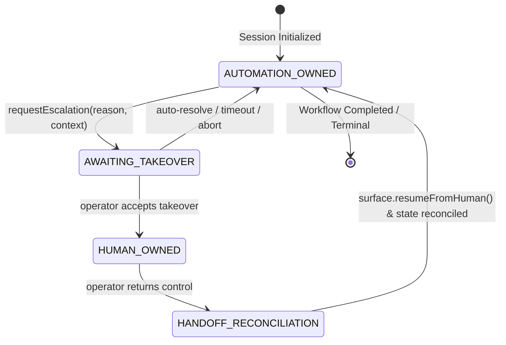

# ADR-005: Control-Transfer Model, State Machine, and Human-in-the-Loop Escalation

## Status
Accepted

## Context
Computer-use automation in enterprise and legacy banking/insurance environments inevitably encounters situations where automation cannot or must not proceed autonomously:
1. **Targeting Exhaustion:** Critical DOM elements cannot be matched across any targeting tier (semantic, anchor, structural, visual) due to layout mutations or unhandled dynamic iframe injection.
2. **Interactive Anti-Automation / 2FA Challenges:** CAPTCHA, biometric prompts, or SMS/email multi-factor authentication (2FA) that require out-of-band human credentials.
3. **High-Risk Irreversible Operations:** High-risk actions (e.g. account deletion, fund transfers, record purging) that are classified as `CONFIRM` or `BLOCK` by safety policies (see [ADR-004](file:///Users/aryankaradia/projects/interface-ai-oa/docs/adr/ADR-004-risky-vs-reversible-action-policy.md)) and require human sign-off before proceeding.
4. **Repetitive Dead-Ends & Stuck Loops:** Discovery or replay loops that hit non-advancing cycles or unhandled modal overlays where recovery retries are exhausted.

In traditional robotic process automation (RPA), failures either crash the workflow or trigger a full process abort. In computer use for core workflows, aborting is prohibitively expensive because it discards multi-step state, active logins, and temporary tokens.

We require a real, robust **control-transfer mechanism** allowing a human operator to take over the **exact same live session** (preserving browser context, cookies, DOM state, and network connections), resolve the obstacle, and transfer control back to the automation engine with zero state loss.

---

## Decision

We implement a formal **Session Ownership State Machine** governed by `SessionCoordinator` and the `Surface` abstraction. The state machine tracks explicit ownership transitions and eliminates race conditions between automated event dispatch and human physical input.

### 1. State Machine Architecture

The four discrete lifecycle states are:

| State | Ownership | Input Authority | Description |
| :--- | :--- | :--- | :--- |
| `AUTOMATION_OWNED` | Automation Engine | Playwright / synthetic drivers only | The executor or discovery agent has exclusive rights to dispatch actions. |
| `AWAITING_TAKEOVER` | Transition Seam | Frozen (all inputs muted) | Automation has detected an unresolvable blocker and frozen synthetic inputs. The escalation payload is published; the system waits for an operator. |
| `HUMAN_OWNED` | Human Operator | Physical mouse/keyboard only | The human operates directly in the live session via the UI/CLI. Synthetic automation is strictly inhibited. |
| `HANDOFF_RECONCILIATION` | Reconciliation Seam | Perception/Validation only | The operator signals completion. The system captures fresh perception, verifies post-conditions, and re-establishes automation preconditions. |

---

### 2. The Three Architectural Seams

#### A. The Pause Seam (`surface.pauseForHuman`)
When an escalation condition is triggered:
- The running loop (Replay or Discovery) halts its step progression.
- `surface.pauseForHuman(message)` is invoked. In browser surfaces (`PlaywrightSurface`), an overlay banner or console badge is injected informing the user that automation has yielded control.
- An immutable `TakeoverRequest` payload is constructed, containing:
  - `id`: Unique escalation UUID.
  - `goal`: Active task goal.
  - `stepId` & `stepIndex`: Precise location where the blocker occurred.
  - `reason`: Classification (`TARGETING_EXHAUSTED`, `DEAD_END_DETECTED`, `HIGH_RISK_ACTION_CONFIRMATION`, `CAPTCHA_OR_2FA_DETECTED`, etc.).
  - `message`: Detailed diagnostic context.
  - `currentUrl`: Live URL at the time of freeze.
  - `snapshot`: Serialized DOM and screenshot.
  - `suggestedAction`: Concrete guidance for the human operator.

#### B. The Cede Seam (Live Session Preservation)
- The underlying browser context (`BrowserContext`, `Page`, CDP session) is kept alive. The automation engine does **not** close or navigate away.
- Both the operator and the automation share the exact same underlying surface reference (`Surface`).
- If running headless in production, the coordinator can attach an interactive VNC/noVNC or CDP screencast stream, or bring the window forward in headed operator stations.

#### C. The Resume & Reconciliation Seam (`surface.resumeFromHuman`)
- When the operator completes intervention, they submit a `TakeoverResolution` with optional diagnostic notes and actor identity.
- The coordinator transitions to `HANDOFF_RECONCILIATION`.
- `surface.resumeFromHuman()` removes visual takeover banners and restores synthetic input handlers.
- The system executes a fresh `perceive()` call to synchronize the internal state with whatever DOM changes the human enacted (e.g. 2FA dismissed, page navigated, form field corrected).
- The coordinator transitions back to `AUTOMATION_OWNED`, and the executor either retries the blocked step or advances to the next step.

---

### 3. Concurrency Safety & Mutex Invariants
Dual-input race conditions (e.g., automation clicking a button while a human is typing their password) are catastrophic in financial workflows.
To enforce absolute exclusivity:
- The coordinator acts as an atomic mutex: calling `requestEscalation()` when not in `AUTOMATION_OWNED` throws a fatal error.
- All step dispatch in `ReplayExecutor` and `DiscoveryAgent` checks coordinator state prior to emitting any mouse or keyboard action.
- The complete timeline is logged immutably via `getOwnershipTimeline()`, capturing:
  - `fromState`: Previous state
  - `toState`: New state
  - `actor`: Actor responsible (`automation`, `operator`, `system`)
  - `timestamp`: High-resolution ISO timestamp
  - `reason`: Justification for transition

---

## Consequences

### Positive
- **No Progress Loss:** Complex legacy flows that take 10+ steps to reach an authenticated screen do not need to restart from step 1 when hitting a transient challenge.
- **Auditability & Regulatory Compliance:** Every handoff is recorded with full attribution. Auditors can distinguish automated actions from human interventions.
- **Clean Architecture Seams:** Decouples the decision of *when* to escalate from *how* the operator interacts (CLI, web dashboard, mock operator).

### Trade-offs & Mitigations
- **Resource Holding:** Keeping browser instances open while awaiting human response consumes memory.
  *Mitigation:* Configurable escalation timeout (default 5 minutes); if no operator acknowledges, the session transitions to `AUTOMATION_OWNED` with a terminal `HUMAN_TAKEOVER_TIMEOUT` failure.
